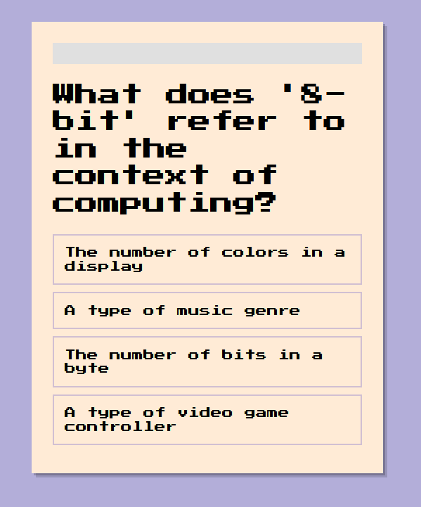
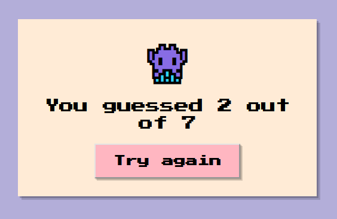

# React

Try the quiz yourself ⬇
You can view live project [HERE](https://di-marko.github.io/3-quiz).

### Quiz

### Result Window

### 👀 Summary:

    1. Staged content rendering
    2. Progress bar
    3. Passing props to render the survey result
